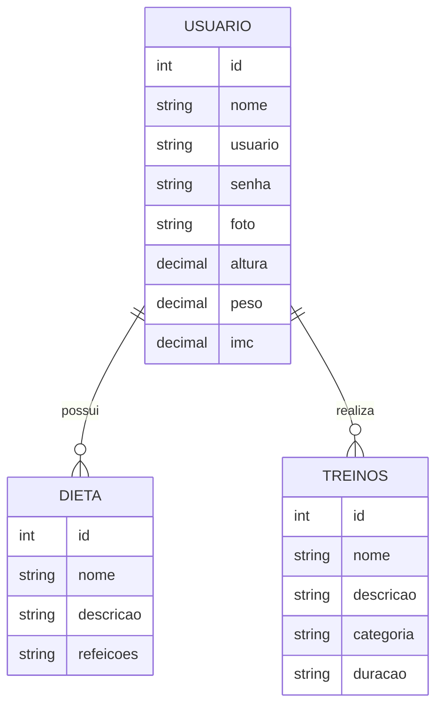

<h1 align="center">🏋🏻‍♀️ VittaFit</h1>

<p align="center">
  
</p>

<p align="center">
  <em>Plataforma de Delivery de Alimentos Saudáveis</em>
</p>

<p align="center">
  
  
  
  
  
  
</p>

---

## 📖 Sobre o Projeto

O **Vittafit** é uma aplicação backend para gerenciamento personalizado de saúde, treinos e alimentação, permitindo que usuários acompanhem seus dados físicos, dietas e rotinas de exercícios de forma centralizada..

A proposta conecta usuários a trocarem experiencia **fit, de treino e dieta** — trazendo praticidade sem abrir mão da saúde.

---

## 🧩 Problema & Solução

A maioria dos apps de delivery prioriza fast food, dificultando o acesso a opções saudáveis. O VittaRun resolve isso com uma plataforma **focada exclusivamente em alimentação saudável**.

| Problema | Solução |
|----------|---------|
| 🚫 Usuários possuem informações de treino e dieta espalhadas em múltiplas plataformas. | ✅ Centralização dos dados em uma única aplicação |
| 🚫 Aplicativos genéricos muitas vezes não permitem adaptar treinos e dietas para cada usuário. | ✅ Relacionamento individual entre usuários, dietas e treinos. |
| 🚫 Muitos usuários não conseguem acompanhar métricas corporais com facilidade. | ✅ Armazenamento de informações como: Altura, Peso, Foto de perfil, dados fisicos atualizados. |

---

## ✨ Funcionalidades

### 👤 Usuários

| Método | Descrição |
|--------|-----------|
| `findAll()` | Lista todos os usuários cadastrados |
| `findById()` | Retorna um usuário pelo ID |
| `findByUsuario()` | Busca usuário pelo e-mail/usuário |
| `create()` | Cadastra um novo usuário |
| `update()` | Atualiza dados do usuário |
| `delete()` | Remove um usuário do sistema |

---

### 🥗 Dietas

| Método | Descrição |
|--------|-----------|
| `findAll()` | Lista todas as dietas cadastradas |
| `findById()` | Retorna uma dieta pelo ID |
| `create()` | Cadastra uma nova dieta |
| `update()` | Atualiza uma dieta existente |
| `delete()` | Remove uma dieta do sistema |

---

### 🏋️ Treinos

| Método | Descrição |
|--------|-----------|
| `findAll()` | Lista todos os treinos cadastrados |
| `findById()` | Retorna um treino pelo ID |
| `create()` | Cadastra um novo treino |
| `update()` | Atualiza dados de um treino |
| `delete()` | Remove um treino do sistema |

---


### 🧠 Recursos da API

| Recurso | Descrição |
|--------|-----------|
| `Swagger` | Documentação automática da API |
| `TypeORM` | Persistência e manipulação de dados |
| `PostgreSQL` | Banco de dados relacional |
| `ValidationPipe` | Validação de dados enviados |
| `Environment Variables` | Configuração segura de ambiente |
| `SSL Connection` | Conexão segura com PostgreSQL Cloud |

---



---

## 🌐 Endpoints da API

### 👤 Usuários

| Método | Endpoint | Descrição |
|--------|-----------|-----------|
| `GET` | `/usuarios` | Lista todos os usuários |
| `GET` | `/usuarios/:id` | Busca usuário por ID |
| `GET` | `/usuarios/usuario/:usuario` | Busca usuário pelo e-mail/usuário |
| `POST` | `/usuarios` | Cadastra um novo usuário |
| `PUT` | `/usuarios` | Atualiza dados do usuário |
| `DELETE` | `/usuarios/:id` | Remove um usuário |

---

### 🥗 Dietas

| Método | Endpoint | Descrição |
|--------|-----------|-----------|
| `GET` | `/dietas` | Lista todas as dietas |
| `GET` | `/dietas/:id` | Busca dieta por ID |
| `POST` | `/dietas` | Cadastra uma nova dieta |
| `PUT` | `/dietas` | Atualiza uma dieta |
| `DELETE` | `/dietas/:id` | Remove uma dieta |

---

### 🏋️ Treinos

| Método | Endpoint | Descrição |
|--------|-----------|-----------|
| `GET` | `/treinos` | Lista todos os treinos |
| `GET` | `/treinos/:id` | Busca treino por ID |
| `POST` | `/treinos` | Cadastra um novo treino |
| `PUT` | `/treinos` | Atualiza um treino |
| `DELETE` | `/treinos/:id` | Remove um treino |


---

## 🛠️ Tecnologias Utilizadas

| Tecnologia | Finalidade |
|------------|-----------|
| **NestJS** | Framework backend |
| **TypeScript** | Linguagem de desenvolvimento |
| **MySQL** | Banco de dados relacional |
| **TypeORM** | Integração com o banco de dados |
| **class-validator** | Validação de dados dos DTOs |
| **Insomnia** | Testes das requisições HTTP |

---

## 🚀 Como Executar

### Pré-requisitos

- Node.js v20+
- MySQL v8+
- npm

### Instalação

```bash
# Clone o repositório
git clone https://github.com/Grupo-5-JS-14/Backend-Fitness-Personalizado.git

# Acesse a pasta do projeto
cd Backend-Fitness-Personalizado

# Instale as dependências
npm i
```

### Rodando a aplicação

```bash
npm run start:dev
```

> A API estará disponível em `http://localhost:4000`

---

## 👥 Equipe

Projeto desenvolvido pela turma **JavaScript 14** da **Generation Brasil**:

| Nome |
|------|
| <a href="https://github.com/DougSan7" target="_blank" rel="noopener noreferrer">Douglas Santos</a> - P.O |
| <a href="https://github.com/Dessxevy" target="_blank" rel="noopener noreferrer">Andressa Andrade</a> - Dev|
| <a href="https://github.com/kayanedvlsantos-create">Kay Ira</a> - Dev |
| <a href="https://github.com/lohannab" target="_blank" rel="noopener noreferrer">Lohanna</a> - Dev |
| <a href="https://github.com/gcoutinhoo" target="_blank" rel="noopener noreferrer">Gabriel Coutinho</a> - Dev |
| <a href="https://github.com/kayanedvlsantos-create">Bruna Zuppini</a> - Dev Tester|
| <a href="https://github.com/luhdias-png" target="_blank" rel="noopener noreferrer">Andre Lucas</a> - Dev Tester|

> São Paulo – SP · 2026

---

## 📄 Licença

Este projeto está sob a licença **MIT**.
